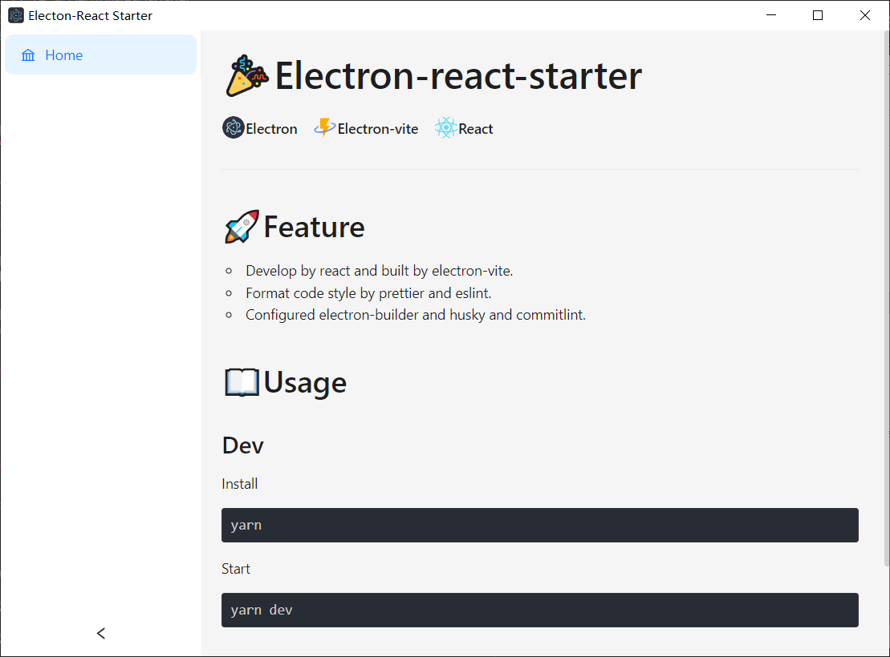

# 🌈Electron-react-starter



## 🚀Tech Stacks

- Develop by react and built by vite.
- Format code style by prettier and eslint.
- Configured electron-builder and husky and commitlint.
- Using google cloud api for OCR and translating.

## 📖Usage

### Desktop OCR.

- [x] press `Alt+D` to invoke a screenshot screen.

- [x] press `Enter` to confirm screen content clip.

- [] ocr results and translation will be shown in content window.

### Translation with OCR result

- [x] send OCR results to translation function.

### Dev

```shell
# Install
yarn
```

```shell
# Start
yarn dev
```

### Package

```shell
# ENV: dev | prod
yarn build:[ENV]
```

## Design

### Purpose

- screen capture. which can be implemented locally.

- ocr support for at least Japanese and English

- translate support for at least Japanese and English

- show pronunciation for at least English, better with Japanese

### How and where to use this tool?

I want to use this tool for game content translating.

ocr --> text recognition --> translation
