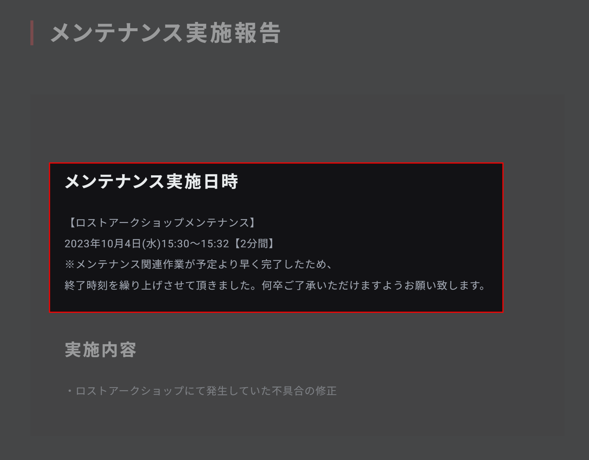
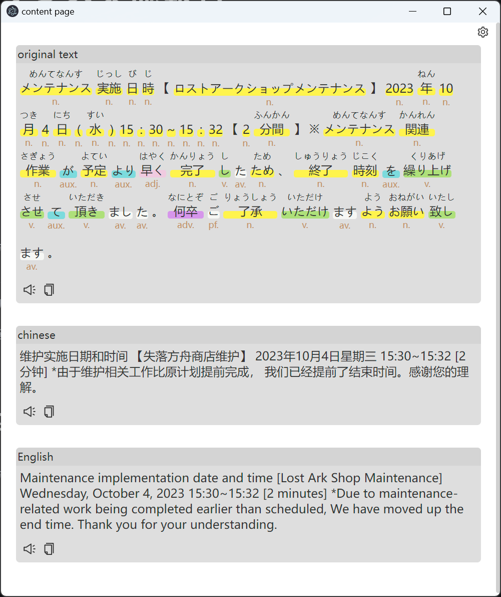

# Desktop-orc-translator



> press `Alt+D` to invoke screenshot mode. press `Enter` to confirm clip.



> ocr and translate content show

## 🚀Tech Stacks

- Develop by react and built by vite.
- Using google cloud api for OCR and translating.

## 🗼Features

### OCR

- using `Google Vision API` for text annotation.

- only configured for `Japanese` ocr currently.

- change ocr language type in UI is not supported yet.

### Sentence Syntax Analyze

- using [`Mecab-wasm`](https://github.com/itayperl/mecab-wasm) for sentence Syntax Analyze.

- _NOTICE_: only supported for Japanese.

### Translate

- using `Google Translate API` for text translating.

- currently only `English` and `Chinese` are configured for translating.

## 📖Usage

### Desktop OCR.

- [x] press `Alt+D` to invoke a screenshot screen.

- [x] press `Enter` to confirm screen content clip.

- [x] ocr results and translation will be shown in a popup window.

### Translation with OCR result

- [x] send OCR results to translation function.

### Dev

```shell
# Install
yarn
```

```shell
# Start
yarn dev
```

### Package

```shell
# ENV: dev | prod
yarn build:[ENV]
```

## TODO

- [] more UI implementation

- [] enable OCR and translate config

- [] more feature on screenshot stage. e.g. supporting a float toolbar aside the clip area for multiple post-process.
